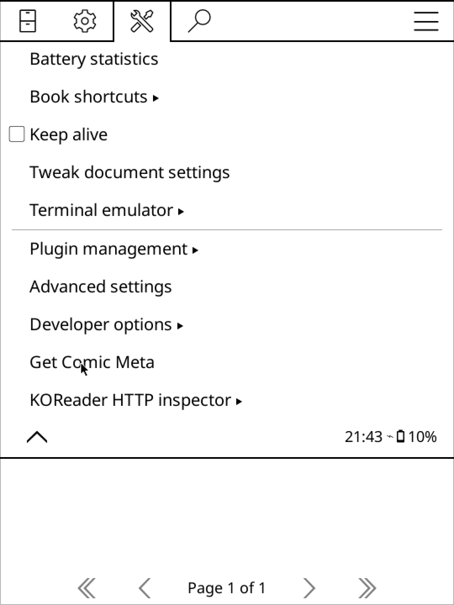

# Getting Started

This guide will walk you through the installation and usage of ComicMeta.

## Installation

Follow these simple steps to get started:

1. Head over to the [releases page](https://github.com/KORComic/comicmeta.koplugin/releases/latest) and grab the latest `.zip` file.
2. Unzip the contents into your **plugins** folder.
3. In folder explorer, got to more tools:
   
   Afterwards, press Get Comic Meta:
   

## Usage

When there is a folder detected, the plugin will ask if recursive extraction is
wanted. If you choose yes, all cbz files in the folder and its subfolders will
be processed. If you choose no, only the cbz files in the current folder will be
processed.
